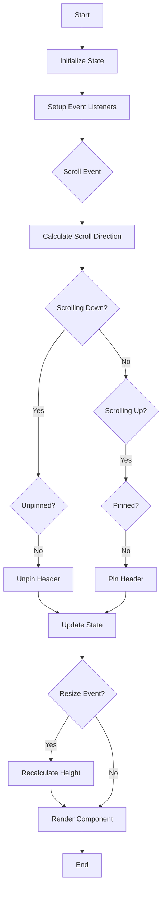

# preact-headquarters: Full Setup and Publishing Guide

## File Structure

```
preact-headquarters/
├── src/
│   ├── HeadQuarters.jsx
│   └── HeadQuarters.css
├── vite.config.js
├── package.json
├── README.md
├── .gitignore
└── .npmignore
```

## Component Code (src/HeadQuarters.jsx)

```jsx
import { h } from 'preact';
import { useState, useEffect, useRef, useCallback } from 'preact/hooks';
import './HeadQuarters.css';

const HeadQuarters = ({
  children,
  pinStart = 0,
  height = 60,
  unpinTolerance = 6,
  className = '',
  pinnedClassName = '',
  unpinnedClassName = '',
  disableInlineStyles = false,
  onPin,
  onUnpin,
  disable = false,
  downTolerance = 5,
  upTolerance = 10,
  stickyOnScrollUp = false,
  transitionDuration = 200,
  wrapperStyle = {},
  wrapperClassName = '',
  calcHeightOnResize = false,
  pinOnReset = true,
  dynamicStyles = null,
}) => {
  const [state, setState] = useState({
    pinned: true,
    unpinned: false,
    top: true,
    scrollDirection: 'none',
    height: height,
  });
  const lastKnownScrollY = useRef(0);
  const currentScrollY = useRef(0);
  const scrollDirection = useRef('none');
  const toleranceExceeded = useRef(false);
  const hqRef = useRef(null);
  const ticking = useRef(false);

  const getScrollY = () => window.pageYOffset || document.documentElement.scrollTop;

  const getHeight = useCallback(() => {
    return calcHeightOnResize && hqRef.current
      ? hqRef.current.offsetHeight
      : height;
  }, [calcHeightOnResize, height]);

  const update = useCallback(() => {
    const scrollY = getScrollY();
    const direction = scrollY > lastKnownScrollY.current ? 'down' : 'up';
    const distanceScrolled = Math.abs(scrollY - lastKnownScrollY.current);

    if (scrollY <= pinStart) {
      setState((prevState) => ({ ...prevState, top: true, pinned: pinOnReset, unpinned: !pinOnReset }));
    } else {
      if (direction === 'down' && !state.unpinned) {
        if (distanceScrolled > downTolerance && !stickyOnScrollUp) {
          setState((prevState) => {
            if (!prevState.unpinned) {
              onUnpin?.();
              return { ...prevState, top: false, pinned: false, unpinned: true, scrollDirection: direction };
            }
            return prevState;
          });
        }
      } else if (direction === 'up' && !state.pinned) {
        if (distanceScrolled > upTolerance) {
          setState((prevState) => {
            if (!prevState.pinned) {
              onPin?.();
              return { ...prevState, top: false, pinned: true, unpinned: false, scrollDirection: direction };
            }
            return prevState;
          });
        }
      }
    }

    lastKnownScrollY.current = scrollY;
    scrollDirection.current = direction;
    ticking.current = false;
  }, [downTolerance, onPin, onUnpin, pinStart, stickyOnScrollUp, state.pinned, state.unpinned, upTolerance, pinOnReset]);

  const handleScroll = useCallback(() => {
    currentScrollY.current = getScrollY();
    if (!ticking.current) {
      window.requestAnimationFrame(() => {
        update();
        ticking.current = false;
      });
      ticking.current = true;
    }
  }, [update]);

  const handleResize = useCallback(() => {
    if (calcHeightOnResize) {
      setState((prevState) => ({ ...prevState, height: getHeight() }));
    }
  }, [calcHeightOnResize, getHeight]);

  useEffect(() => {
    if (!disable) {
      window.addEventListener('scroll', handleScroll, { passive: true });
      if (calcHeightOnResize) {
        window.addEventListener('resize', handleResize);
      }
      return () => {
        window.removeEventListener('scroll', handleScroll);
        if (calcHeightOnResize) {
          window.removeEventListener('resize', handleResize);
        }
      };
    }
  }, [disable, handleScroll, calcHeightOnResize, handleResize]);

  const getStyle = () => {
    if (disableInlineStyles) {
      return {};
    }
    const baseStyle = {
      position: 'fixed',
      top: 0,
      left: 0,
      right: 0,
      zIndex: 1,
      transform: `translateY(${state.unpinned ? -state.height : 0}px)`,
      transition: `transform ${transitionDuration}ms ease-in-out`,
      ...wrapperStyle,
    };
    return dynamicStyles ? { ...baseStyle, ...dynamicStyles(state) } : baseStyle;
  };

  const getClassName = () => {
    const baseClass = 'headquarters';
    const classes = [baseClass, className, wrapperClassName];

    if (state.pinned) classes.push(`${baseClass}--pinned`, pinnedClassName);
    if (state.unpinned) classes.push(`${baseClass}--unpinned`, unpinnedClassName);
    if (state.top) classes.push(`${baseClass}--top`);
    classes.push(`${baseClass}--${state.scrollDirection}`);

    return classes.filter(Boolean).join(' ');
  };

  if (disable) {
    return <div className={className}>{children}</div>;
  }

  return (
    <div
      ref={hqRef}
      style={getStyle()}
      className={getClassName()}
    >
      {children}
    </div>
  );
};

export default HeadQuarters;
```

## CSS (src/HeadQuarters.css)

```css
.headquarters {
  will-change: transform;
  transition: transform 200ms linear;
}

.headquarters--pinned {
  transform: translateY(0%);
}

.headquarters--unpinned {
  transform: translateY(-100%);
}

.headquarters--top {
  /* Styles for when the header is at the top of the page */
}

.headquarters--not-top {
  /* Styles for when the header is not at the top of the page */
}

.headquarters--scrolling-up {
  /* Styles for when scrolling up */
}

.headquarters--scrolling-down {
  /* Styles for when scrolling down */
}

/* Utility classes */
.hq-shadow {
  box-shadow: 0 2px 4px rgba(0, 0, 0, 0.1);
}

.hq-transparent {
  background-color: transparent;
  transition: background-color 200ms linear;
}

.hq-solid {
  background-color: #ffffff;
  transition: background-color 200ms linear;
}

.hq-animated {
  transition: all 200ms ease-in-out;
}

/* Example media query for disabling on larger screens */
@media (min-width: 1024px) {
  .hq-disable-large {
    transform: translateY(0) !important;
    transition: none !important;
  }
}

/* Example styles for a sticky sidebar */
.hq-sidebar {
  height: 100vh;
  width: 250px;
  position: fixed;
  top: 0;
  left: 0;
  will-change: transform;
  transition: transform 200ms linear;
}

.hq-sidebar.headquarters--unpinned {
  transform: translateX(-100%);
}

/* Accessibility */
@media (prefers-reduced-motion: reduce) {
  .headquarters {
    transition: none !important;
  }
}
```

## Vite Configuration (vite.config.js)

```javascript
import { defineConfig } from 'vite';
import preact from '@preact/preset-vite';
import { resolve } from 'path';

export default defineConfig({
  plugins: [preact()],
  build: {
    lib: {
      entry: resolve(__dirname, 'src/HeadQuarters.jsx'),
      name: 'PreactHeadquarters',
      fileName: (format) => `preact-headquarters.${format}.js`
    },
    rollupOptions: {
      external: ['preact'],
      output: {
        globals: {
          preact: 'Preact'
        }
      }
    }
  }
});
```

## Package Configuration (package.json)

```json
{
  "name": "preact-headquarters",
  "version": "1.0.0",
  "description": "A dynamic header component for Preact applications",
  "main": "dist/preact-headquarters.umd.js",
  "module": "dist/preact-headquarters.es.js",
  "exports": {
    ".": {
      "import": "./dist/preact-headquarters.es.js",
      "require": "./dist/preact-headquarters.umd.js"
    },
    "./style.css": "./dist/style.css"
  },
  "files": [
    "dist"
  ],
  "scripts": {
    "dev": "vite",
    "build": "vite build",
    "preview": "vite preview"
  },
  "keywords": ["preact", "header", "scroll", "ui", "component"],
  "author": "Your Name",
  "license": "MIT",
  "peerDependencies": {
    "preact": "^10.5.0"
  },
  "devDependencies": {
    "@preact/preset-vite": "^2.5.0",
    "preact": "^10.5.0",
    "vite": "^4.3.9"
  }
}
```

## .npmignore

```
src
vite.config.js
.gitignore
```

## Flowchart



## Steps to Build and Publish npm Package

1. **Setup:**
   - Create a new directory for your project: `mkdir preact-headquarters && cd preact-headquarters`
   - Initialize a new npm project: `npm init -y`
   - Install dependencies: `npm install preact @preact/preset-vite vite --save-dev`

2. **Develop:**
   - Create the file structure as shown above
   - Implement the HeadQuarters component in `src/HeadQuarters.jsx`
   - Add styles in `src/HeadQuarters.css`
   - Configure Vite in `vite.config.js`
   - Update `package.json` with the provided configuration

3. **Build:**
   - Run the build command: `npm run build`
   - This will create a `dist` directory with the built files

4. **Test Locally:**
   - Create a test directory outside your project
   - In the test directory, run `npm link ../preact-headquarters`
   - Create a test Preact app and import HeadQuarters to ensure it works

5. **Prepare for Publishing:**
   - Update the README.md with usage instructions and API documentation
   - Ensure your `package.json` is correctly configured
   - Create a `.npmignore` file to exclude unnecessary files from the package

6. **Publish:**
   - Create an npm account if you haven't: `npm adduser`
   - Log in to npm: `npm login`
   - Publish the package: `npm publish`

7. **Update:**
   - To update the package, make your changes
   - Update the version in `package.json`
   - Rebuild: `npm run build`
   - Publish the new version: `npm publish`

Remember to follow npm's best practices and semantic versioning when updating your package. Always test thoroughly before publishing a new version.
